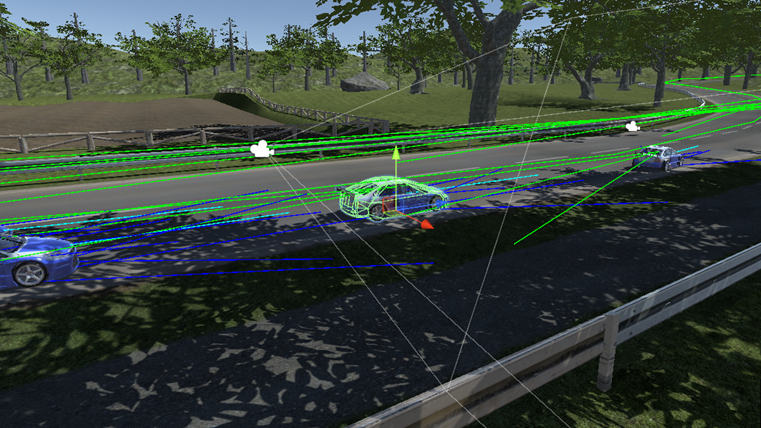

<h1 align = "center">AI Driver Behaviour</h1>

This project aims to create an AI-driven behaviour model for a racing simulation using Unity neglecting fully car dynamics. These would be achieved using Applied mathematics (majorly Vector calculation, mathematical functions) and AI techniques (revolving around decision making then pathfinding and Autonomous Agents) to model these systems.

**AI-Driven Behaviour Model**

The vehicle (Car system) is built upon the Unity Physics Wheel Collider, where torque is applied to them to move the vehicle or stop it. 

