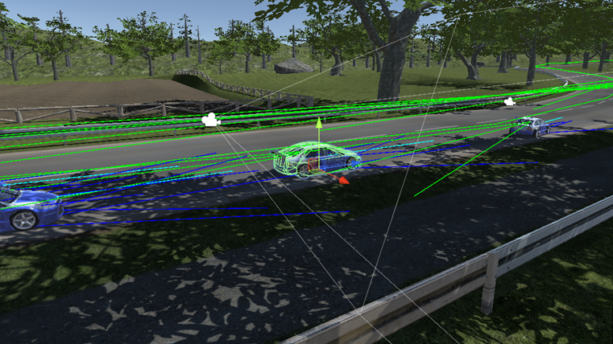
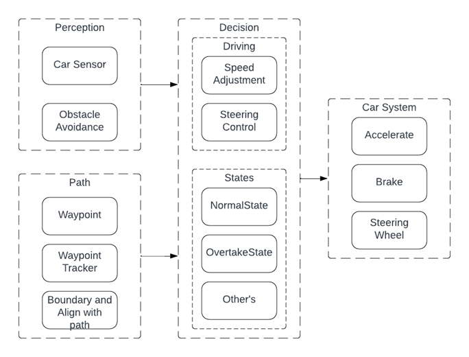

<h1 align = "center">AI Driver Behaviour</h1>

 

This project aims to create an AI-driven behaviour model for a racing simulation using Unity neglecting fully car dynamics. These would be achieved using Applied mathematics (majorly Vector calculation, mathematical functions) and AI techniques (revolving around decision making then pathfinding and Autonomous Agents) to model these systems.

Youtube Video: https://www.youtube.com/watch?v=AIhsho8lrnU

<h2 align = "left">AI-Driven Behaviour Model</h2>

The vehicle (Car system) is built upon the Unity Physics Wheel Collider, where torque is applied to them to move the vehicle or stop it. 

    

<h2 align = "left">List of Features</h2>

|Features             |Description                                                                                                           |
|:--------------------|:---------------------------------------------------------------------------------------------------------------------|
|Finite State machine |Stores states and condition of Driver Behaviour                                                                       | 
|Fuzzy Logic and Set  |For modelling drivers decision making for speed adjustment for a degree of trueness                                   |
|Obstacles Avoidance  |For Driver perception and awareness of the play space and avoiding collisions                                         |
|Pathfinding          |Traditional waypoints are placed across the play space and the use of vecvtor calculation. For keeping driver in track|
